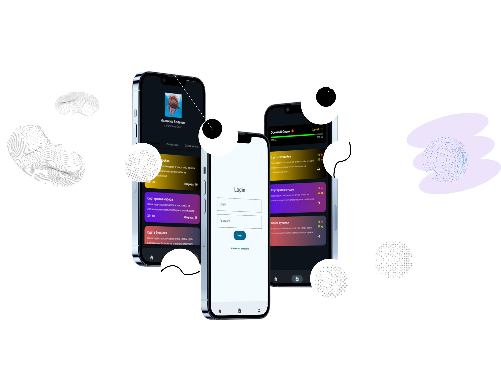

**# GreenRostov

Это приложение было разработано в рамках кейса "Зеленый Ростов" (ПАО КБ "Центр-инвест") на XV Форуме программных разработчиков Ростова-на-Дону "Хакатон Осень 2024".

## Оглавление
1. [Скриншоты](#скриншоты)
    - [Приветственный экран](#приветственный-экран)
    - [Светлая тема](#светлая-тема)
    - [Темная тема](#темная-тема)
2. [Цели и задачи приложения](#цели-и-задачи-приложения)
3. [Используемые технологии](#используемые-технологии)
4. [Реализованный функционал](#реализованный-функционал)
5. [Результаты работы](#результаты-работы)
6. [Портфолио](#портфолио)

## Скриншоты

### Приветственный экарн

  
  
  

### Светлая тема

  
  
  

### Темная тема

  
  
  

## Цели и задачи приложения
- **Отслеживание углеродного следа**: Анализ повседневных действий и покупок пользователей для расчета их экологического воздействия.
- **Геймификация и мотивация**: Внедрение системы наград и достижений за участие в экологических инициативах.
- **Удобство и доступность**: Создание простого и интуитивно понятного интерфейса для пользователей всех возрастов.
- **Интеграция с городскими программами**: Обеспечение взаимодействия с городскими экологическими сервисами.

## Используемые технологии
| **Категория**              | **Технология**                                                                                           |
|----------------------------|----------------------------------------------------------------------------------------------------------|
| **Архитектура**            | Clean Architecture с MVVM для разделения логики и интерфейса.                                            |
| **Сетевые запросы**        | Retrofit для работы с REST API.                                                                          |
| **Аутентификация**         | Firebase для безопасной аутентификации пользователей.                                                    |
| **Локальное хранение**     | DataStore для хранения токенов и настроек.                                                               |
| **Навигация**              | Navigation Component для управления переходами между экранами.                                           |
| **UI-компоненты**          | HorizontalPager для реализации onboarding-экрана, Jetpack Compose для реализации интерфейсов приложения. |
| **Безопасность**           | Secrets Gradle для защиты конфиденциальной информации.                                                   |
| **Управление зависимостями** | Dagger-Hilt для внедрения зависимостей.                                                                  |

## Реализованный функционал
- **Аутентификация**: Реализован экран входа и регистрации с использованием Firebase.
- **Onboarding**: Приветственный экран с использованием HorizontalPager для ознакомления пользователей с функционалом приложения.
- **Запросы к API**: Настроены запросы к REST API для получения данных (включая моковые данные из-за неработоспособности внешнего API).
- **Профиль пользователя**: Моковый экран профиля с отображением базовой информации.
- **Достижения и инвентарь**: Реализованы моковые экраны для отображения достижений и инвентаря пользователя.
- **История действий**: Моковый экран для отображения истории экологических действий пользователя.

    

## Результаты работы
За 48 часов разработана основа мобильного приложения, включающая ключевые функции, такие как аутентификация, onboarding, запросы к API и моковые экраны для профиля, достижений и истории. Приложение готово к дальнейшей разработке и интеграции с реальными API для расчета углеродного следа и взаимодействия с городскими экологическими программами.

## Портфолио
Для более подробного ознакомления с проектом и другими моими работами, вы можете посетить мое портфолио на [Behance](https://www.behance.net/gallery/222004489/Android-Developer-Portfolio).